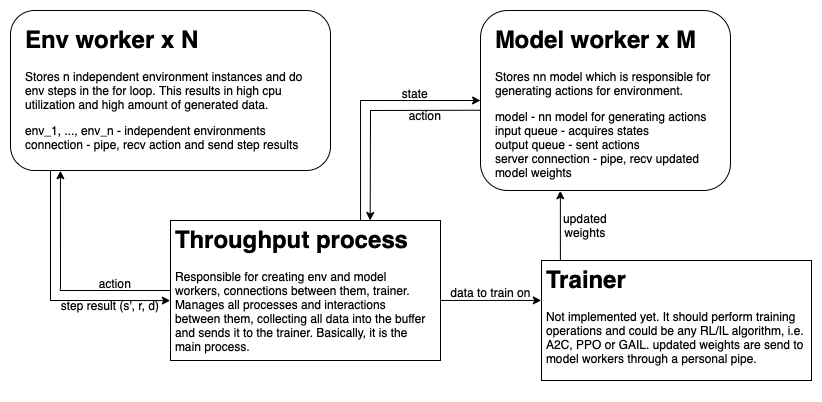

# Fast PyTorch Reinforcement and Imitation Learning (Work in progress)
I've implemented and tested couple of RL and IL algorithms in my previous
[*project*](https://github.com/CherryPieSexy/imitation_learning),
but it is build on top of the gym async vector env,
which is not quite fast solution for gathering experience from multiple environments.

In this project I am trying to make a similar framework (maybe not as general as the previous one)
but focusing on the speed of data collecting and training.

Design is not one of my strength, but I tried to make a descriptive visualization
of the current structure of the parallelized experience collection from independent environments:


## Throughput tests
I've measured throughput in frames per second across different environments
on two machines, for single env and gym vec env I report the highest numbers I get during the tests.
For proposed approach I report 2 parameter configurations: default one and the best one;
results are summarized in the following tables:

### MacBook pro M1 10 core CPU, no GPU

default parameters: ```n=512, N=8, M=3```, for Crafter ```n=16, N=4, M=2```

| method                        | CartPole | HalfCheetah | Crafter |
|-------------------------------|----------|-------------|---------|
| single env                    | ~20k     | ~13k        | 167     |
| gym vec env                   | 60k      | 37k         | 507     |
| my method, default parameters | 715k     | 187k        | 557     |
| my method, best parameters    | 1232k    | 198k        | 1113    |

Best parameters for environments:

| env and number of collected frames     | n    | N   | M   | fps   |
|----------------------------------------|------|-----|-----|-------|
| CartPole @ 100M frames                 | 2048 | 8   | 1   | 1232k |
| HalfCheetah @ 10M frames               | 512  | 8   | 1   | 198k  |
| Crafter @ 100K frames                  | 8    | 8   | 1   | 1113  |

### PC with AMD Ryzen 9 5950x 16 core CPU + nvidia RTX 3080ti GPU (TODO)

## Free section
I am inspired by this awesome project by Alex Petrenko: https://github.com/alex-petrenko/sample-factory

Any suggestions or contributions are welcome.
Feel free to contact me directly through the email or the telegram.

TODO:
- [x] Create readme
- [x] Code environment and model workers, throughput process
- [x] Test speed on the selected environments, add results to the table
- [ ] Make automatic detection of optimal throughput parameters
(number of envs n, number of env workers N, number of model workers M)
- [ ] Create some data buffer to store rollouts in
- [ ] Add basic trainer A2C to test if this approach works
- [ ] Add advanced trainer (PPO)
